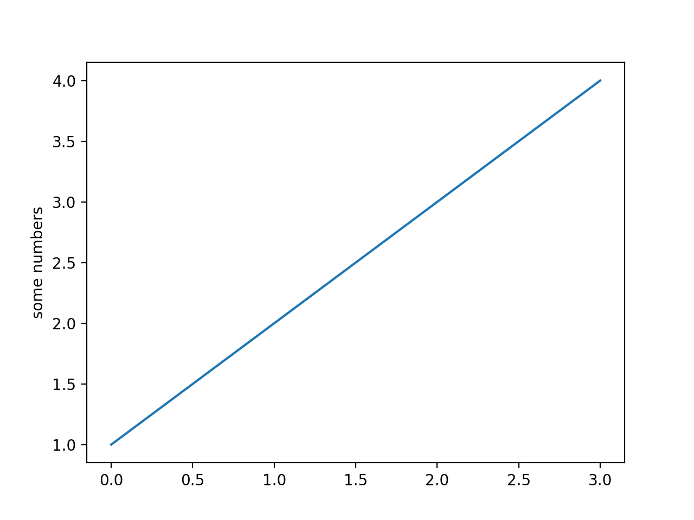

# Dictionaries
Today we are going to cover, among other things, dictionaries, which are [collectibles](https://medium.com/@aitarurachel/data-structures-with-lists-tuples-dictionaries-and-sets-in-python-612245a712af) (data structures that can store more than one value).

__Collectibles can contain anything:__ nothing, integers, floats, booleans, strings, other lists, a mix of things, other complex data structures.

| Data Structure | Ordered | Mutable | Constructor       | Example                  |
|----------------|---------|---------|-------------------|--------------------------|
| List           | yes     | yes     | `[]` or `list()`  | `[5.7, 4, 'yes', 5.7]`   |
| Tuple          | yes     | no      | `()` or `tuple()` | `(5.7, 4, 'yes', 5.7)`   |
| Set            | no      | yes     | `{}`* or `set()`  | `{5.7, 4, 'yes'}`        |
| Dictionary     | no      | yes**   | `{}` or `dict()`  | `{'Jun': 75, 'Jul': 89}` |

 - `(*)` You can use curly braces to define a set like this: `{1, 2, 3}`. However, if you leave the curly braces empty like this: `{}` Python will instead create an empty dictionary. So to create an empty set, use `set()`.
 - `(**)` A dictionary itself is mutable, but each of its individual keys must be immutable.


## Dictionaries

- A dictionary is a collection of data mappings.
- It is written in Python using curly brackets `{ }` and accessed using square brackets `[ ]`.
- Each value in the list is accessed at a unique key (8, True, -6, 3.14, etc) and the key must be immutable.
- Dictionaries are mutable (values can change, pairs can be added, pairs can be removed).

Dictionary _keys_
- can be anything immutable
- Integers, Floating point numbers, Booleans,Strings
- Are unique

Dictionary _values_
- can be anything
- Don't have to be unique

For this example, all of the keys are ‘a’,’b’,’c’, etc. for convenience.

| Value              | Example                                         |
|--------------------|-------------------------------------------------|
| Nothing            | `{}`                                            |
| Integers           | `{'a': 1, 'b': 5, 'c': 3}`                      |
| Floats             | `{'a': 3.14159, 'b': 1.41421, 'c': 2.71828}`    |
| Booleans           | `{'a': True, 'b': False, 'c': True}`            |
| Strings            | `{'a': "Hi", 'b': "There"}`                     |
| Lists              | `{'a': [3, 1], 'b': [4, 1]}`                    |
| Other Dictionaries | `{'a': {'a': 1, 'b': 5, 'c': 3}, 'b': {}}`      |
| A mix of things    | `{'a': 1.0, 'b': "hi", 'c': {'a': [23, True]}}` |

### Accessing dictionaries

To add a key-value pair, just set its key and value using square brackets.
```python
groceries = {"apple":5, "cereal": 1, "soup":3, "lettuce":1}

groceries["bread"] = "2"
print(groceries) # { 'bread':2 }
```
To change the value at a key, again use square brackets
```python
groceries["cereal"] = 2
print(groceries)
```
To access a value in a dictionary, use square brackets and its key
```python
fruits = groceries["apple"]
print(fruits)
```
To remove a key, use
```python
del groceries["lettuce"]
print(groceries)
```
Warning: If you delete a key from a dictionary and it wasn’t in there in the first place, you will get an error.

### Length and equality

`len()` gives the number of pairs in the dictionary
```python
len(groceries)
```
`==` tells if dictionaries are the same
```python
{ 2: False, "hi":3.4, True:8 } == { 2:False, "hi": 3.4, True: 8 } # True
{ 2: False, "hi":3.4, True:8 } == { 2:False, "hi": 3.4 } # False
{ 2: False, "hi":3.4, True:8 } == { 2:7, "hi": 3.4, True: 8 } # False
```

Warning: `==` only works correctly on lists of integers, floats, booleans, and sublists or tuples full of those. It does not work correctly when Objects are involved unless the Objects also have the `==` method working for them.

### Dictionary Methods
[W3Schools list of dictionary methods](https://www.w3schools.com/python/python_ref_dictionary.asp)
```python
grocery_keys = list(groceries.keys()) # returns a sequence of the keys and we convert it to a list
print(grocery_keys)
grocery_values = list(groceries.values()) # returns a sequence of values and we convert it to a list
print(grocery_values)
```
Warning: You cannot control the order in which the keys and values appear but they will match each other.
```python
x = groceries.copy() # makes a copy of the dictionary
```
Things that happen to the copy will not affect the original and vice versa. Warning: This is not quite true when Objects are involved.

> **Try it Yourself**:
> 1. Print out "Spot's" birthday from the birthdays dictionary.
> 2. Add "Sparky" to the birthdays dictionary with the birthday "May 10".
```python
birthdays = {
    "Bill": "Sept 5",
    "Spot": "April 19",
    "Apple": "June 30",
    "Carla": "Dec 21"
}
```

## Modules

A python module is a python file that can be imported in another python file.
```python
import math                 # alias the math module. to call a function: math.sqrt(5)
from math import sqrt, sum  # import specific functions/classes. to call: sqrt(5)
from math import *          # import everything (not recommended). to call: sqrt(5)
```

A file can be imported from a subfolder. This only works if the subfolder has an empty `__init__.py` inside:
```python
from subfolder.test import hello
hello()
```

## Navigating Folders/Files in shell
| Command |  |
| --- | --- |
| `cd subfolder` | navigate down into subfolder directory |
| `cd ..` | navigate one directory up |
| `mkdir subfolder2` | creates subfolder2 at current path |
| `mkdir subfolder/subsubfolder` | creates a folder at given path |
| `ls` | lists all files in current directory |
| `python main.py` | runs a python file in the current directory |
| `python -m unittest` | finds and runs all unittests in the current directory and subdirectories |

## Reading / Writing from/to files
Before we can read or write to a file we have to open it:
```python
file = open('test.txt')
```
By default files are opened in `read` mode but we can also open them in write mode:

```python
file = open('test.txt', 'w')
```
As this is a delicate operation that can fail (for example the file doesn't exist) we do want to ensure we only continue working with that file if the opening was successful:

```python
with open('test.txt') as file:
    # This block only gets executed if the file was opened successfully
    # it will also automatically close the file.
```

We can read the entire content of a file using `read()`:
```python
with open('test.txt') as file:
    text = file.read()
    print(text)
```

We can also read it line by line:
```python
with open('test.txt') as file:
    for line in file.readlines():
        print(line)
```

You may notice the extra new lines between each line. That happens because each line in a file has an invisible new line ending.

By default when printing, python adds another new line. We can avoid this by provinding an `end=` optional parameter:
```python
with open('test.txt') as file:
    for line in file.readlines():
        print(line, end="")
```

To write to a file we can open it in write mode:
```python
f = open("test2.txt", "w")
f.write("Now the file was created with this content!")
f.close()
```

Notice that if we do not have a `with` block we should `close` the file when it is no longer needed to avoid consuming unnecessary resources.

We can also append something at the end of an existing file by opening it in append mode:
```python
f = open("test2.txt", "a")
f.write("This line will be added at the end of the file!")
f.close()
```

## JSON Files
Json is a universal data-exchange format that looks like this:
```Json
{
  "name": "Samuel Adams",
  "age": 23,
  relatives: [
    {
      "name": "unknown",
    },
  ],
  "alive": false,
}
```
The only syntax difference to a python dictionary is that all keys must be strings.
Often used for server-to-server and server-to-client communication. We can create any python object into a json string using the `dumps()` function in the json library:
```python
import json

x = {1: "abc", "2": 2, "3": None, "4": True, "5": []}
y = json.dumps(x)
print(y)
# {"1": "abc", "2": 2, "3": null, "4": true, "5": []}

# you can optionaly provide an intent to nicely format your json:
y = json.dumps(x, intent=2)
print(y)
# {
#   "1": "abc",
#   "2": 2,
#   "3": null,
#   "4": true,
#   "5": []
# }
```
Note that all keys are converted to strings, so you can't have `1` and `"1"` as keys simultaniously. This resulting string can be conveniently stored in a file.

You can revert back a JSON string into a python object:
```python
import json

string = "{\"1\": \"abc\", \"2\": 2, \"3\": null, \"4\": true, \"5\": []}"
obj = json.loads(string)
print(obj)
# {'1': 'abc', '2': 2, '3': None, '4': True, '5': []}
```


> **Try it Yourself**:  Notice the file `person.json`.
>
> We made a mistake, the birthyear should be `1722`, not `1723`.
> Fix the birthyear using only python by:
> 1) loading the file in write mode and translating the json content into a python dictionary
> 2) modify the python dictionary, translate it back into json and store the json string back into the file
> 3) Test if everything works by loading the file a second time in read mode and see if the birthyear was changed.

## Plotting Data
A core concept taught in 203 is the plotting of data. The best way to learn/refresh this is to walk through a series of examples on the [matplotlib website](https://matplotlib.org/stable/tutorials/pyplot.html#sphx-glr-tutorials-pyplot-py).



In essence we import the matplotlib library and just like with turtle use a series of instructions (in the correct order) to produce a plot. This is very similar to how we achieve things with the turtle library.

The plot above is produced with the following code:
```python
import matplotlib.pyplot as plt

plt.plot([1, 2, 3, 4])
plt.ylabel('some numbers')
plt.show()
```

The best approach to create fancy plots is to:
1. Check out and fully understand the data you are dealing with
2. Find a plot example on the website that is best suited to plot your data
3. Copy the example from the website and adapt it to work for your data

## Testing
If you intend to work as a developer in any capacity my promise to you is that you will not land a job if you don't know how to properly test your code.

Testing is much more than just quality assurance as you will learn soon in CSCI 204, if you take that course.

Lets assume you have a file `my_math.py` that contains one function:
```python
# my_math.py
def square(number = 10):
  return number * number
```

Its a good idea to not test code in the same file as it is written as it quickly becomes messy and, worse, testing may interfer with the core functionality of your program, requiring you to do extra work once done with testing.

Its much better to separate tests in their own files and and use a testing library such as [unittest](https://docs.python.org/3/library/unittest.html):
```python
# test_my_math.py
import unittest
from my_math import square

class TestMyMath(unittest.TestCase):
  def test_square(self):
    self.assertEqual(square(), 100, "square() should return 100")
    self.assertEqual(square(1), 1, "square(1) should return 1")
```

Please ignore the line containing `class` for now. Although there is much more to it than that for now think of a class as a container for functions.

Important is that there is a function called `test_square()` inside that contains function calls using `assert` statements.

The example works like the following:
```python
self.assertEqual(left, right, message)
```

If left and right are the same (equal) then the test passes (all good), otherwise it fails and `message` will appear.

You could have also testet like this:
```python
if left != right:
  print(message)
```
The problem with this approach is that something could go wrong and we do not know where in the code the error happend or what caused it. Further the program could break and only show one test at a time.

With unittests we can independently test several functions and if one fails the other ones are still testet.

To run the tests unittest can automatically detect all test files that start with `test_` in the file name and contain `test_` methods in a test class.

```shell
python -m unittest
```
