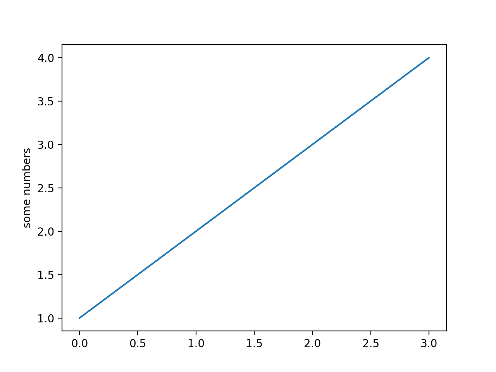
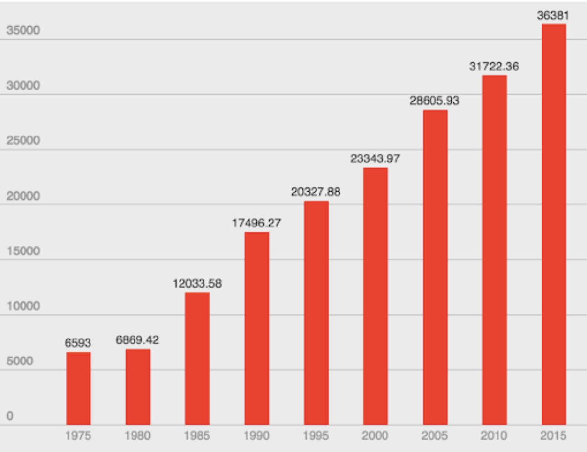

## Instructions

In this example you are going to plot the data that we worked on before noon. The idea is to show how both average tuition rate and income has raised over time.

You will find that university privilege is becoming more and more exclusive! :(

We have copied the csv files from the morning session into this repository but feel free to use a dataset of your own interest if you find one or have something in mind already.

## Plotting Data
This section is a copy of what you find in the original instructions repository.

A core concept taught in 203 is the plotting of data. The best way to learn/refresh this is to walk through a series of examples on the [matplotlib website](https://matplotlib.org/stable/tutorials/pyplot.html#sphx-glr-tutorials-pyplot-py).



In essence we import the matplotlib library and just like with turtle use a series of instructions (in the correct order) to produce a plot. This is very similar to how we achieve things with the turtle library.

The plot above is produced with the following code:
```python
import matplotlib.pyplot as plt

plt.plot([1, 2, 3, 4])
plt.ylabel('some numbers')
plt.show()
```

The best approach to create fancy plots is to:
1. Check out and fully understand the data you are dealing with
2. Find a plot example on the website that is best suited to plot your data
3. Copy the example from the website and adapt it to work for your data


## Final Result
If you go fancy all the way your final product may look like this:


